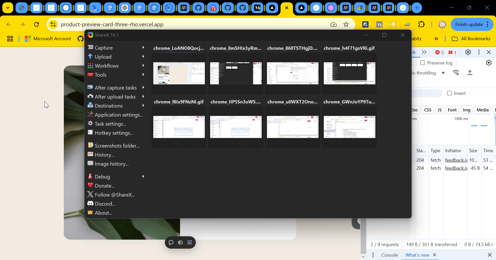

# Frontend Mentor - Product preview card component solution

This is a solution to the [Product preview card component challenge on Frontend Mentor](https://www.frontendmentor.io/challenges/product-preview-card-component-GO7UmttRfa).

## Table of contents

- [Overview](#overview)
  - [The challenge](#the-challenge)
  - [Screenshot](#screenshot)
  - [Links](#links)
- [My process](#my-process)
  - [Built with](#built-with)
  - [What I learned](#what-i-learned)
  - [Continued development](#continued-development)
  - [Useful resources](#useful-resources)
- [Author](#author)

## Overview

### The challenge

Users should be able to:

- View the optimal layout depending on their device's screen size
- See hover and focus states for interactive elements

### Screenshot



### Links

- Solution URL: [Github link](https://github.com/snigdha-sukun/product-preview-card)
- Live Site URL: [Product Preview Card](https://product-preview-card-three-rho.vercel.app/)

## My process

### Built with

- Semantic HTML5 markup
- CSS

### What I learned

I learned how to use different image for different viewport sizes:

```html
<picture class="illustration">
      <source srcset="./images/image-product-desktop.jpg" media="(min-width: 28em)" height="450" />
      <source srcset="./images/image-product-mobile.jpg" media="(max-width: 27em)" />
      
</picture>
```

I learned how to use `@media` to set styling for different viewport sizes:

```css
main {
    background-color: var(--white);
    margin: 5%;
    border-radius: 3%;
    overflow: hidden;
    display: flex;
    flex-direction: row;
    flex-wrap: wrap;
    width: fit-content;
}

@media (min-width: 28em) {
  main {
    flex-wrap: nowrap;
    width: 600px;
    height: 450px;
  }
}
```

### Continued development

I still need to practice the positioning an element & `@media`. I also need to learn about responsive CSS in general & HTML5 rules.

### Useful resources

- [Responsive image](https://web.dev/learn/design/picture-element) - I learned how to use different pictures for different viewports.
- [Media queries](https://web.dev/learn/design/media-queries) - This is an amazing article which helped me how to begin using `@media`. I'd recommend it to anyone still learning this concept.

## Author

- Frontend Mentor - [@snigdha-sukun](https://www.frontendmentor.io/profile/snigdha-sukun)
